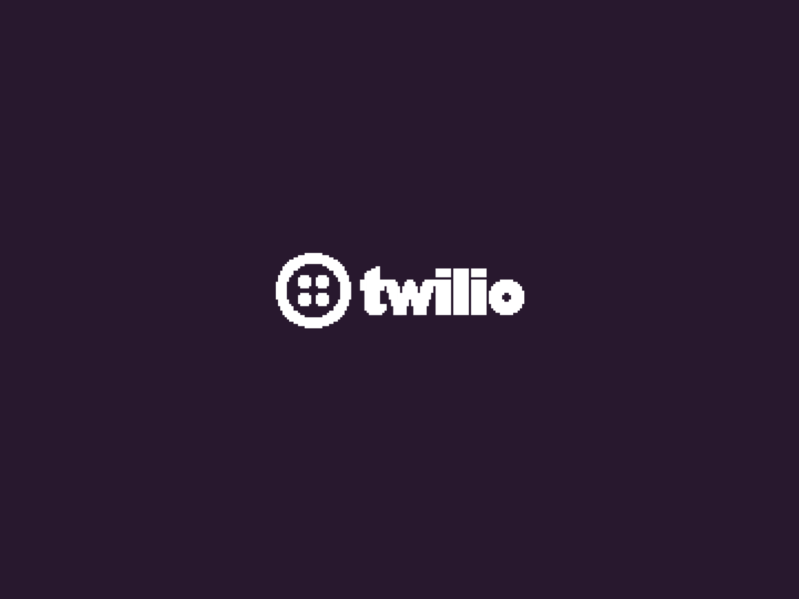

# Bot-Whatsapp-Twillio-with-Flask

    

<h4  align="center">
	🔍 ChatBot Project with Twillio and Flask
</h4>

## 🔭 Project

This project demonstrates the development of a simple yet effective chatbot using Twilio's messaging API and Flask, a lightweight WSGI web application framework in Python. The chatbot is designed to interact with users through SMS or WhatsApp, providing automated responses based on user queries.

## 💜 Requirements
- Python 3.6 ou later
- Flask
- Twilio SDK
- Ngrok (for local testing with webhooks)

## 👽 Integrations
* **[Ngrok](https://ngrok.com/)** - Ngrok is a tool that allows you to expose a local server to the internet through secure tunnels. This is particularly useful for web development and testing, as it allows you to share your local development environment with others and test webhooks from external services like Twilio, GitHub, or Stripe.

## 🤠 Getting Started

Not Finished